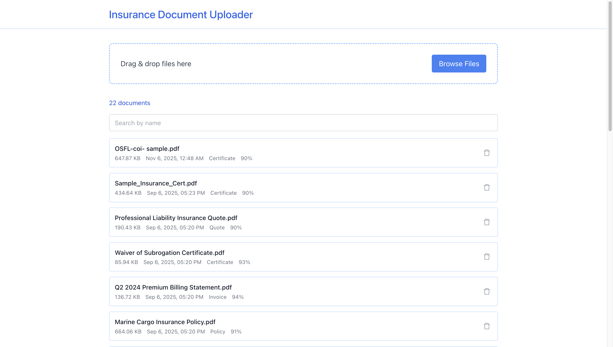

# Insurance Document Uploader

A modern, beautiful web application for uploading and managing insurance documents with AI-powered classification.



## Features

- **Drag & Drop Upload**
- **Document Gallery**
- **Document Management**
- **React Tailwind UI**

## Getting Started

### Prerequisites

- Node.js 18+ and npm

### Installation

```bash
npm install
```

### Development

```bash
npm run dev
```

The app will be available at `http://localhost:5173`

### Build

```bash
npm run build
```

## API Configuration

The API key is configured in `src/utils/constants.js`. Update it if needed.

Base URL: `https://interview-classification-api.onrender.com`

